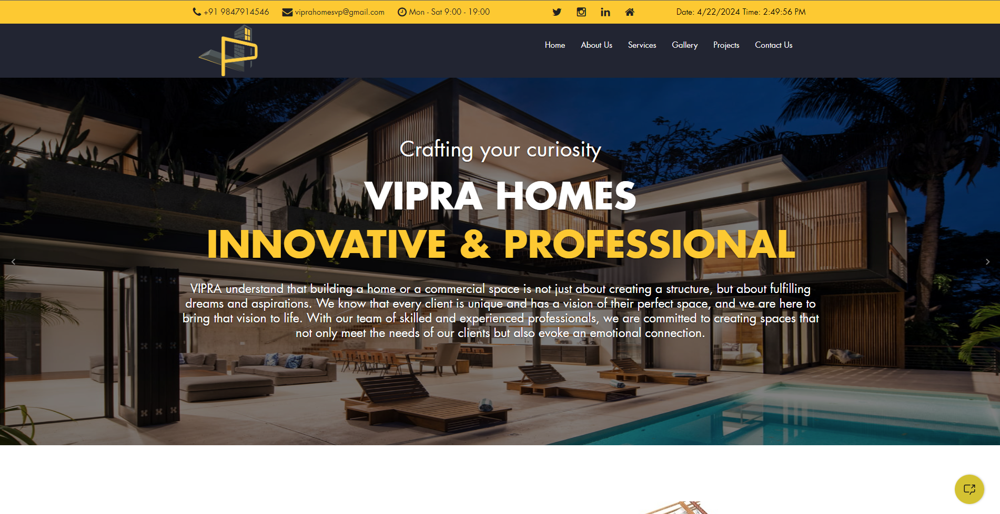

## Live Demo

Check out the live demo [here](https://tidkeashok007.github.io/html-css-js-vipra_homes/).

# VIPRA Homes Project

Welcome to the VIPRA Homes Project! This repository contains the source code for the VIPRA Homes website, showcasing a collection of HTML, CSS, and JavaScript files.

## Overview

The VIPRA Homes Project presents a modern and user-friendly website for browsing properties. With HTML, CSS, and JavaScript, it offers a seamless experience for users interested in real estate.

## Features

- Intuitive user interface for property browsing
- Responsive design for optimal viewing across devices
- Interactive elements powered by JavaScript

## Usage

To view the VIPRA Homes website, simply open the `index.html` file in a web browser.

## License

This project is licensed under the [MIT License](LICENSE).
